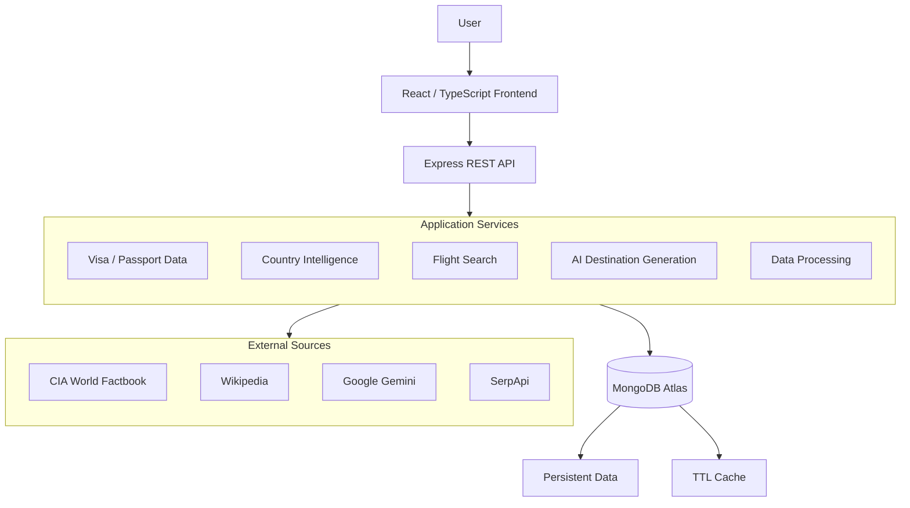

<p align="center">
  <h1 align="center">BorderLess</h1>
  <p align="center">
    A global mobility platform combining visa intelligence, passport rankings, country exploration, AI-generated destination insights, and flight discovery.
  </p>
</p>

<p align="center">
  <a href="https://borderless-ochre.vercel.app/">Live Demo</a> ·
  <a href="https://github.com/dodoododo/borderless">Repository</a> 
  <!-- <a href="#getting-started">Documentation</a> -->
</p>

<p align="center">
  
  
  
  
</p>

---

## Overview

BorderLess is a full-stack platform built around a single question: *where can I go, how can I get there, and what should I know before I go?*

It brings together passport strength rankings, visa requirement exploration, country intelligence, an interactive world map, AI-generated destination guidance, and real-time flight search into one application. Rather than wrapping a single API, BorderLess is built around a data pipeline that aggregates, normalizes, and caches information from several independent sources — structured geopolitical datasets, scraped visa data, generative AI, and third-party flight data — and exposes it through a unified interface.

## Table of Contents

- [Product](#product)
  - [Visa Intelligence](#visa-intelligence)
  - [Passport Rankings](#passport-rankings)
  - [Country Explorer](#country-explorer)
  - [Interactive World Map](#interactive-world-map)
  - [Flight Discovery](#flight-discovery)
  - [Destination Guides](#ai-destination-guides)
- [Preview](#preview)
- [Data Architecture](#data-architecture)
- [System Architecture](#system-architecture)
- [Data Pipeline](#data-pipeline)
- [Engineering Highlights](#engineering-highlights)
- [Design Philosophy](#design-philosophy)
- [Technology Stack](#technology-stack)
- [Getting Started](#getting-started)
- [Project Structure](#project-structure)
- [Data Sources & Responsible Use](#data-sources--responsible-use)
- [Limitations & Data Accuracy](#limitations--data-accuracy)
- [Roadmap](#roadmap)
- [Developer](#developer)
- [License](#license)

---

## Product

### Visa Intelligence

The core of BorderLess. Users select a passport and explore where that passport can travel, with entry requirements broken down into categories: visa-free access, visa on arrival, eVisa eligibility, and standard visa-required destinations. The visa explorer is paired with the interactive map, so requirement data can be read geographically rather than as a flat list.

### Passport Rankings

A global ranking view of passport strength and mobility. Users can compare passports against one another, see relative mobility scores, and understand how many destinations a given passport can access without a traditional visa application.

### Country Explorer

Every country in the dataset has a profile page combining geography, demographics, government structure, economic indicators, infrastructure, transportation, and communications data with travel-specific context and AI-generated destination guidance. This is a country intelligence layer, not a static country page — structured facts and generative explanation sit side by side.

### Interactive World Map

Built with `deck.gl` and `maplibre-gl`, the map is a first-class part of the product rather than a decorative element. It supports visualizing visa accessibility by country, selecting countries interactively to drive the visa explorer and country profiles, and rendering flight routes geographically.

### Flight Discovery

Flight search lets users look up routes between airports and inspect outbound and return options, multi-segment itineraries, airlines, timing, layovers, and pricing. BorderLess surfaces this information — sourced from Google Flights via SerpApi — as a discovery and comparison tool. It is not an airline or a booking provider, and booking actions route to third-party providers.

### AI Destination Guides

Structured data (visa rules, statistics, government and economic facts) is deterministic and sourced from the data pipeline described below. On top of it, BorderLess uses the Google Gemini API to generate contextual destination content: summaries, local insights, practical tips, and location-specific recommendations. Keeping these two layers distinct — facts versus generated guidance — is a deliberate design decision, and AI-generated content is labeled as such in the UI.

## Preview

<p align="center">
  
  
  
  
  
  
  
  
  
  
  
  
  
  
</p>

## Data Architecture

BorderLess is not a thin client over one API — it aggregates four independent data sources, each handled differently:

**CIA World Factbook** — structured geopolitical and statistical data (geography, demographics, economy, government, infrastructure, communications) transformed into application-ready models. See the [World Factbook](https://www.cia.gov/the-world-factbook/).

**Wikipedia-derived visa data** — a web-scraping and parsing pipeline that extracts publicly available visa policy information and classifies it into categories such as visa-free, visa required, eVisa, and visa on arrival. This is scraped, publicly-editable source material, not an official government feed — see [Limitations & Data Accuracy](#limitations--data-accuracy).

**Google Gemini** — generative AI used for contextual destination content, cached in MongoDB so repeated requests for the same destination don't require regeneration. See the [Gemini API docs](https://ai.google.dev/).

**SerpApi / Google Flights** — real-time flight search results, parsed into a structured, comparable format. See [SerpApi](https://serpapi.com/).

## System Architecture



The backend mediates every external call. Nothing in the frontend talks to CIA data, Wikipedia, Gemini, or SerpApi directly — all of it is normalized into consistent internal models first, then persisted or cached in MongoDB, then served through the API.

## Data Pipeline


**01 — Source.** Data originates from the CIA World Factbook, Wikipedia, SerpApi, and Gemini.

**02 — Acquisition.** Data is retrieved, scraped, parsed, and normalized, with validation applied where the source structure allows it.

**03 — Transformation.** Raw, heterogeneous source formats are converted into consistent application-specific data models shared across the API and frontend.

**04 — Storage / Cache.** MongoDB Atlas stores persistent application data alongside TTL-indexed collections for short-lived data such as AI-generated guides and flight search results, so they expire automatically instead of being manually invalidated.

**05 — Delivery.** The Express API exposes processed data through REST endpoints consumed by the frontend, so the frontend never needs to know whether a response came from cache or from a live external call.

**06 — Visualization.** The frontend turns delivered data into passport rankings, visa matrices, country profiles, the interactive map, flight results, and charts (via Apache ECharts and Recharts).

**Why cache at all.** External calls to Gemini and SerpApi are the slowest and most expensive part of the system. Routing repeat requests through a MongoDB TTL cache — `External APIs → Processing → MongoDB Cache → Application` — means a popular destination guide or flight route is generated or fetched once per TTL window rather than once per request.

## Engineering Highlights

- **Multi-source aggregation.** Structured datasets, scraped content, third-party APIs, and generative AI are combined behind a single consistent data model rather than exposed to the frontend as separate integrations.
- **Data normalization.** The Factbook, Wikipedia extraction, Gemini, and SerpApi each return data in a different shape. Backend services are responsible for converting all of it into the same internal schema before it reaches the API layer.
- **Intelligent caching.** MongoDB TTL indexes bound the lifetime of AI-generated content and flight search results, reducing redundant calls to paid or rate-limited external services.
- **Asynchronous data flows.** Visa data, country data, AI generation, and flight search are independent asynchronous operations coordinated across frontend and backend rather than a single blocking request chain.
- **Geospatial visualization.** `deck.gl` and `maplibre-gl` handle WebGL-based rendering for country-level and route-level geographic data at interactive frame rates.
- **Separation of concerns.** Presentation, API communication, business logic, external integrations, data persistence, and caching are kept in distinct layers in both the frontend and backend.

## Design Philosophy

BorderLess uses an editorial, neo-brutalist visual language: strong typography, high contrast, deliberate borders, and dense, well-organized information blocks rather than soft, decorative UI. The goal is editorial information design applied to a global mobility platform — dense data made scannable through hierarchy, not simplified by hiding it.

## Technology Stack

**Frontend**
React 19 · TypeScript · Vite · Tailwind CSS v4 · deck.gl · maplibre-gl · Apache ECharts · Recharts

**Backend**
Node.js · Express.js

**Database**
MongoDB Atlas, including TTL indexes for caching

**External Data / Services**
CIA World Factbook · Wikipedia (scraping/extraction pipeline) · Google Gemini API · SerpApi (Google Flights data)

**Deployment**
Vercel (frontend) · Render (backend)

## Getting Started

### Prerequisites

- Node.js 18+
- MongoDB Atlas cluster or a local MongoDB instance
- A SerpApi API key
- A Google Gemini API key

### Clone

```bash
git clone https://github.com/dodoododo/borderless.git
cd borderless
```

### Backend

```bash
cd backend
npm install
npm run dev
```

`.env` (backend):

```env
PORT=5000
MONGO_URI=your_mongodb_connection_string
SERPAPI_API_KEY=your_serpapi_key
GEMINI_API_KEY=your_gemini_key
```

### Frontend

```bash
cd frontend
npm install
npm run dev
```

`.env` (frontend):

```env
VITE_API_BASE_URL=http://localhost:5000/api
VITE_MAPTILER_KEY=your_maptiler_public_key
```

## Data Sources & Responsible Use

BorderLess aggregates information from independent third-party sources, each with different update cadences and reliability characteristics:

- [CIA World Factbook](https://www.cia.gov/the-world-factbook/) — geopolitical and statistical data
- [Wikipedia](https://www.wikipedia.org/) — source material for the visa data extraction pipeline
- [Google Gemini](https://ai.google.dev/) — generative destination content
- [SerpApi](https://serpapi.com/) and [Google Flights](https://www.google.com/travel/flights) — flight search data

Visa and immigration rules can change with little notice. BorderLess is an informational and exploratory tool — it is **not** a replacement for official immigration authorities, embassies, consulates, or government travel advisories. Users should verify entry requirements against official sources before making travel decisions.

## Limitations & Data Accuracy

- Visa requirement data is derived from a Wikipedia scraping and parsing pipeline. It reflects publicly available, community-maintained information and is not sourced from or verified against official government or embassy channels.
- Flight data reflects a snapshot returned by SerpApi/Google Flights at query time and can change before booking is completed elsewhere.
- AI-generated destination content is produced by Gemini and may contain inaccuracies; it is intended as contextual guidance, not authoritative fact.
- Country statistics follow the CIA World Factbook's own publication and update schedule and may lag real-world changes.

## Roadmap

**Current**
Passport rankings, visa requirement exploration, country profiles, the interactive map, flight search, and AI-generated destination guides described above.

**Planned**
- More granular visa requirement data and edge cases (transit visas, dependent territories)
- Workflows for cross-checking scraped visa data against official sources
- Deeper country-to-country comparison tools
- More advanced flight filtering
- Saved trips and itinerary building
- User accounts
- More sophisticated route visualization on the map
- Historical mobility analysis over time
- Additional AI-assisted travel planning features

## Developer

**Tăng Ngọc Hậu**
Junior Full-Stack Developer · Information Technology student at Da Nang University of Science and Technology

Focused on full-stack, data-driven applications — React/TypeScript frontends, Node.js backends, MongoDB-backed data pipelines, interactive geospatial visualization, and AI integration.


